Credits by @ShinjiMC

# Comparison of Sorting Methods [ENG]

In this document, we will analyze and compare various popular sorting methods used in computer science. Each sorting method will be explained in detail, including its description and computational complexity analysis with Big-O notation. We will also present a C++ program to validate this analysis and generate line charts using GO (Golang) or Python.

## Sorting Methods

### Bubble Sort
#### Description
The Bubble Sort algorithm compares pairs of adjacent elements and swaps them if they are in the wrong order. This process is repeated until the list is sorted.
#### Computational Complexity
- Worst Case: O(n^2)
- Best Case: O(n)
- Average Case: O(n^2)

The code for this algorithm can be found in `BubbleSort.h`.

### Heap Sort
#### Description
Heap Sort uses a heap data structure to organize the elements of the list. Elements are extracted one by one from the heap, resulting in a sorted list.
#### Computational Complexity
- Worst Case: O(n log n)
- Best Case: O(n log n)
- Average Case: O(n log n)

The code for this algorithm can be found in `HeapSort.h`.

### Insertion Sort
#### Description
Insertion Sort compares each element with the previous ones in the list and inserts the element in the correct position, shifting larger elements.
#### Computational Complexity
- Worst Case: O(n^2)
- Best Case: O(n)
- Average Case: O(n^2)

The code for this algorithm can be found in `InsertionSort.h`.

### Selection Sort
#### Description
Selection Sort searches for the smallest element in the list and places it at the beginning. It then looks for the second smallest element and places it next, and so on.
#### Computational Complexity
- Worst Case: O(n^2)
- Best Case: O(n^2)
- Average Case: O(n^2)

The code for this algorithm can be found in `SelectionSort.h`.

### Shell Sort
#### Description
Shell Sort divides the list into smaller subgroups and sorts each subgroup using an insertion algorithm. It then merges the sorted subgroups.
#### Computational Complexity
- Worst Case: Depends on the gap sequence (varies)
- Best Case: Depends on the gap sequence (varies)
- Average Case: Depends on the gap sequence (varies)

The code for this algorithm can be found in `ShellSort.h`.

### Merge Sort
#### Description
Merge Sort divides the list in half, sorts each half, and then combines the sorted halves to obtain a sorted list.
#### Computational Complexity
- Worst Case: O(n log n)
- Best Case: O(n log n)
- Average Case: O(n log n)

The code for this algorithm can be found in `MergeSort.h`.

### Quick Sort
#### Description
Quick Sort selects a pivot element and divides the list into two subgroups: elements smaller than the pivot and elements larger than the pivot. It then recursively sorts the subgroups.
#### Computational Complexity
- Worst Case: O(n^2)
- Best Case: O(n log n)
- Average Case: O(n log n)

The code for this algorithm can be found in `QuickSort.h`.

You can find the code for each algorithm in their respective files on GitHub.

## Comparison Program and Charts

We developed a program in C++ that implements each of these sorting methods and used input data ranging from 3 quantities to 13 quantities ("0", "5", "10", "50", "100", "250", "500", "1500", "1000", "2500", "5000", "7500", "10000"). Below are the results of the comparison using line charts:

### Case 1: (0, 5, 10)
In this case, we can observe a significant disparity in execution times. Merge Sort exhibits significantly slower performance than the others, reaching up to 0.12 seconds. On the other hand, the other algorithms, including Bubble Sort, Heap Sort, Insertion Sort, Selection Sort, and Shell Sort, have execution times in the range of 0.0003 to 0.0015 seconds. This suggests that, for small datasets, any of these algorithms would be suitable, with Insertion Sort and Selection Sort being the most efficient options.

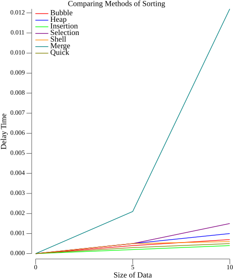

### Case 2: (0, 5, 10, 50)
As the dataset size increases, the differences in execution times become more evident. Merge Sort remains the slowest algorithm, but now others, such as Insertion Sort, Quick Sort, and Shell Sort, also show longer execution times. Bubble Sort, while faster than Merge Sort, is still not an efficient choice for larger datasets. Selection Sort stands out as one of the slowest in this case.

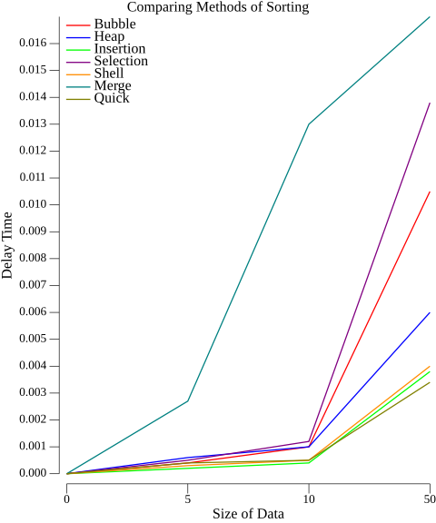

### Case 3: (0, 5, 10, 50, 100)
This case presents interesting changes. Bubble Sort and Selection Sort, which used to be faster than Merge Sort, now exhibit slower performance in comparison. On the other hand, Heap Sort and Quick Sort stand out as efficient options, with shorter execution times than the others. This suggests that the choice of the right algorithm depends on the size and nature of the data.

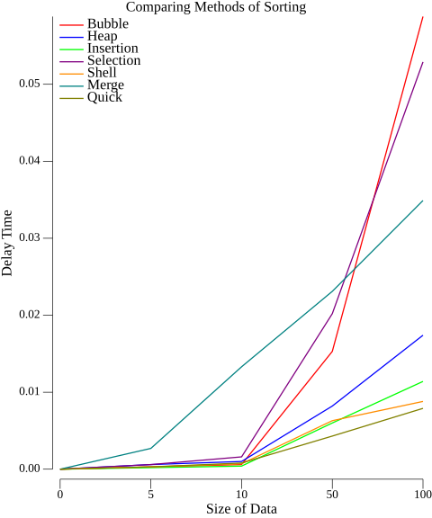

### Case 4: (0, 5, 10, 50, 100, 250)
The results continue to vary as the dataset size increases. Selection Sort and Bubble Sort remain slower compared to other algorithms. Quick Sort stands out as the fastest in this case, with an execution time of 0.02 seconds, while Merge Sort and Heap Sort have longer execution times.

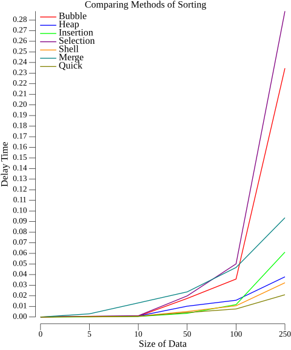

### Case 5: (0, 5, 10, 50, 100, 250, 500)
The dataset size keeps growing, and the differences in execution times also increase. Selection Sort and Bubble Sort become even less efficient. Insertion Sort shows acceptable performance in this case. Quick Sort continues to be one of the most efficient algorithms.

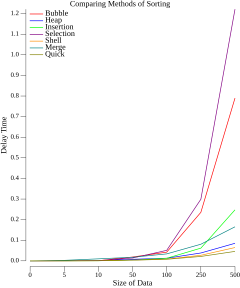

### Case 6: (0, 5, 10, 50, 100, 250, 500, 1500)
At this point, Selection Sort and Bubble Sort have considerably longer execution times, making them impractical for datasets of this size. Insertion Sort outperforms Merge Sort in efficiency.

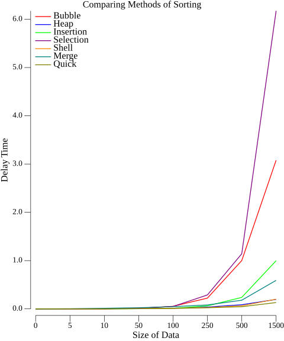

### Case 7: (0, 5, 10, 50, 100, 250, 500, 1500, 1000)
The dataset size keeps growing, and Selection Sort becomes even more inefficient with an execution time of 11 seconds. Insertion Sort and Merge Sort exhibit similar performance, while Quick Sort remains fast.

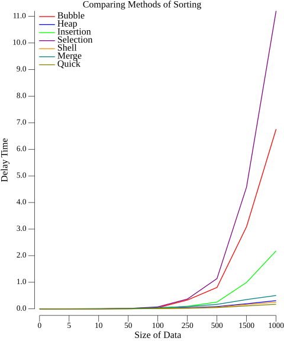

### Case 8: (0, 5, 10, 50, 100, 250, 500, 1500, 1000, 2500)
Selection Sort reaches an execution time of 28 seconds, making it extremely slow compared to other algorithms. Merge Sort, Heap Sort, Shell Sort, and Quick Sort have similar execution times, but Quick Sort remains the fastest.

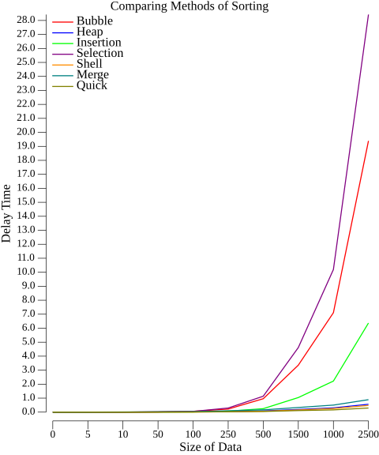

### Case 9: (0, 5, 10, 50, 100, 250, 500, 1500, 1000, 2500, 5000)
At this point, Selection Sort, Bubble Sort, and Insertion Sort have significantly longer execution times than the other algorithms. Quick Sort continues to be the fastest.

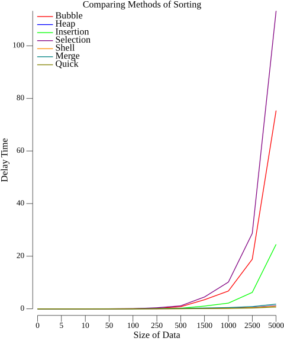

### Case 10: (0, 5, 10, 50, 100, 250, 500, 1500, 1000, 2500, 5000, 7500)
The difference in execution times becomes even more evident. Selection Sort and Bubble Sort reach execution times of 240 and 160 seconds, respectively. Insertion Sort outperforms Merge Sort, but Quick Sort remains the fastest.

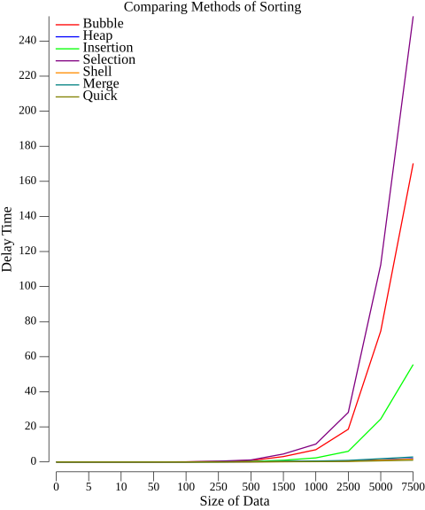

### Case 11: (0, 5, 10, 50, 100, 250, 500, 1500, 1000, 2500, 5000, 7500, 10000)
In the final case, Selection Sort and Bubble Sort have extremely long execution times of 440 and 300 seconds, respectively. Insertion Sort is also slow compared to other algorithms. Quick Sort continues to be the fastest.

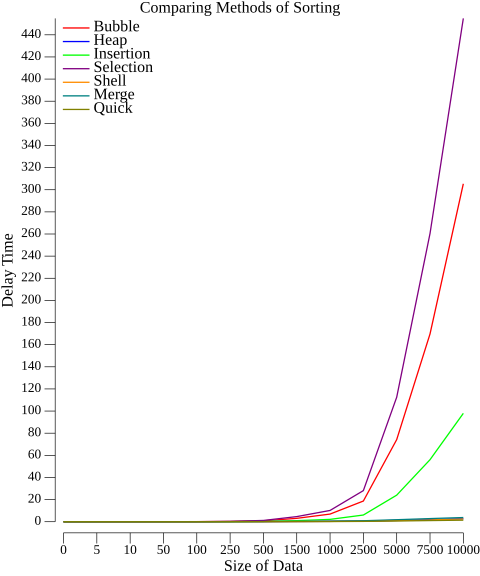

* This plot is generated by Python

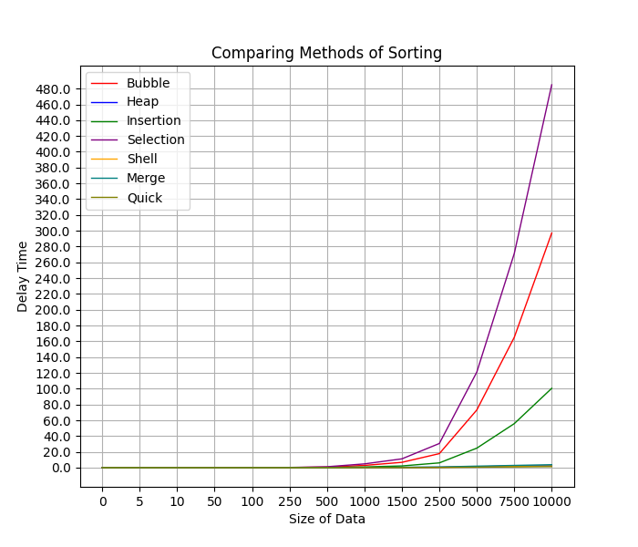

## Conclusions

After thoroughly analyzing and comparing various sorting methods and their respective computational complexities, as well as conducting practical experiments with datasets of different sizes, we have reached several important conclusions:

1. **Algorithm Selection**: The choice of a sorting algorithm should be based on the specific characteristics of the problem and the size of the data. There is no one "best" algorithm for all cases, as each has its strengths and weaknesses.

2. **Efficiency in Small Datasets**: For small datasets, such as Case 1 (0, 5, 10), most sorting algorithms, including Insertion Sort and Selection Sort, are suitable due to their fast execution times.

3. **Efficiency in Medium Datasets**: As dataset size increases, algorithms like Quick Sort and Heap Sort show more efficient performance and outperform other algorithms, such as Bubble Sort and Selection Sort.

4. **Efficiency in Large Datasets**: For large datasets, Quick Sort stands out as one of the most efficient algorithms due to its average complexity of O(n log n). On the other hand, Bubble Sort and Selection Sort become impractical due to their long execution times.

5. **Differences in Efficiency**: The difference in efficiency among algorithms becomes more evident as dataset size increases. Some algorithms, like Merge Sort and Shell Sort, maintain consistent performance in various situations.

6. **Dependence on Sequence in Shell Sort**: Shell Sort exhibits complexity that depends on the gap sequence used, causing its performance to vary depending on the choice of sequence.

7. **Importance of Empirical Testing**: While theoretical analysis with Big-O notation provides valuable insights, it is essential to support these analyses with empirical testing on real datasets to make precise decisions about algorithm selection.

Ultimately, the choice of the right sorting method should consider the nature of the data and specific performance requirements of the problem. Understanding sorting algorithms and their complexity analysis is crucial for making informed decisions and optimizing the performance of applications and systems in practice.

---
# Comparación de Métodos de Ordenamiento [ESP]

En este documento, analizaremos y compararemos varios métodos de ordenamiento populares utilizados en ciencias de la computación. Cada método de ordenamiento se explicará en detalle, incluyendo su descripción y análisis de complejidad computacional con notación Big-O. También se presentará un programa desarrollado en C++ para comprobar este análisis y se generarán gráficos lineales utilizando GO (Golang) o Python.

## Métodos de Ordenamiento

### Bubble Sort
#### Descripción
El algoritmo Bubble Sort compara pares de elementos adyacentes y los intercambia si están en el orden incorrecto. Este proceso se repite hasta que la lista esté ordenada.
#### Complejidad Computacional
- Peor Caso: O(n^2)
- Mejor Caso: O(n)
- Caso Promedio: O(n^2)

El código de este algoritmo se encuentra en `BubbleSort.h`.

### Heap Sort
#### Descripción
Heap Sort utiliza una estructura de datos de montículo (heap) para organizar los elementos de la lista. Se extraen los elementos uno a uno del montículo, lo que resulta en una lista ordenada.
#### Complejidad Computacional
- Peor Caso: O(n log n)
- Mejor Caso: O(n log n)
- Caso Promedio: O(n log n)

El código de este algoritmo se encuentra en `HeapSort.h`.

### Insertion Sort
#### Descripción
Insertion Sort compara cada elemento con los anteriores en la lista e inserta el elemento en la posición correcta, desplazando los elementos mayores.
#### Complejidad Computacional
- Peor Caso: O(n^2)
- Mejor Caso: O(n)
- Caso Promedio: O(n^2)

El código de este algoritmo se encuentra en `InsertionSort.h`.

### Selection Sort
#### Descripción
Selection Sort busca el elemento más pequeño en la lista y lo coloca al principio. Luego, busca el segundo elemento más pequeño y lo coloca después, y así sucesivamente.
#### Complejidad Computacional
- Peor Caso: O(n^2)
- Mejor Caso: O(n^2)
- Caso Promedio: O(n^2)

El código de este algoritmo se encuentra en `SelectionSort.h`.

### Shell Sort
#### Descripción
Shell Sort divide la lista en subgrupos más pequeños y ordena cada subgrupo utilizando un algoritmo de inserción. Luego, combina los subgrupos ordenados.
#### Complejidad Computacional
- Peor Caso: Depende de la secuencia de pasos (varía)
- Mejor Caso: Depende de la secuencia de pasos (varía)
- Caso Promedio: Depende de la secuencia de pasos (varía)

El código de este algoritmo se encuentra en `ShellSort.h`.

### Merge Sort
#### Descripción
Merge Sort divide la lista en mitades, ordena cada mitad y luego combina las mitades ordenadas para obtener una lista ordenada.
#### Complejidad Computacional
- Peor Caso: O(n log n)
- Mejor Caso: O(n log n)
- Caso Promedio: O(n log n)

El código de este algoritmo se encuentra en `MergeSort.h`.

### Quick Sort
#### Descripción
Quick Sort selecciona un elemento pivot y divide la lista en dos subgrupos: elementos menores que el pivot y elementos mayores que el pivot. Luego, ordena recursivamente los subgrupos.
#### Complejidad Computacional
- Peor Caso: O(n^2)
- Mejor Caso: O(n log n)
- Caso Promedio: O(n log n)

El código de este algoritmo se encuentra en `QuickSort.h`.

## Programa de Comparación y Gráficos

Se desarrolló un programa en C++ que implementa cada uno de estos métodos de ordenamiento y se utilizaron datos de entrada que varían desde 3 cantidades hasta 13 cantidades ("0", "5", "10", "50", "100", "250", "500", "1500", "1000", "2500", "5000", "7500", "10000"). A continuación, se presentan los resultados de la comparación mediante gráficos lineales:

### Caso 1: (0, 5, 10)
En este caso, podemos notar una gran disparidad en los tiempos de ejecución. Merge sort muestra un rendimiento significativamente más lento que los demás, alcanzando hasta 0.12 segundos. Por otro lado, los otros algoritmos, incluyendo Bubble sort, Heap sort, Insertion sort, Selection sort, y Shell sort, tienen tiempos de ejecución en el rango de 0.0003 a 0.0015 segundos. Esto sugiere que, para conjuntos de datos pequeños, cualquiera de estos algoritmos sería adecuado, con Insertion sort y Selection sort siendo las opciones más eficientes.

### Caso 2: (0, 5, 10, 50)
A medida que aumenta el tamaño del conjunto de datos, la diferencia en los tiempos de ejecución se hace más evidente. Merge sort continúa siendo el algoritmo más lento, pero ahora otros, como Insertion sort, Quick sort y Shell sort, también están mostrando tiempos de ejecución más largos. Bubble sort, aunque más rápido que Merge sort, todavía no es una opción eficiente para conjuntos de datos más grandes. Selection sort se destaca como uno de los más lentos en este caso.

### Caso 3: (0, 5, 10, 50, 100)
Este caso presenta cambios interesantes. Bubble sort y Selection sort, que solían ser más rápidos que Merge sort, ahora muestran un rendimiento más lento en comparación. Por otro lado, Heap sort y Quick sort se destacan como opciones eficientes, con tiempos de ejecución más cortos que los demás. Esto sugiere que la elección del algoritmo adecuado depende del tamaño y la naturaleza de los datos.

### Caso 4: (0, 5, 10, 50, 100, 250)
Los resultados continúan variando a medida que aumenta el tamaño del conjunto de datos. Selection sort y Bubble sort siguen siendo más lentos en comparación con otros algoritmos. Quick sort se destaca como el más rápido en este caso, con un tiempo de ejecución de 0.02 segundos, mientras que Merge sort y Heap sort tienen tiempos de ejecución más largos.

### Caso 5: (0, 5, 10, 50, 100, 250, 500)
El tamaño del conjunto de datos sigue creciendo, y las diferencias en los tiempos de ejecución también aumentan. Selection sort y Bubble sort se vuelven aún menos eficientes. Insertion sort muestra un rendimiento aceptable en este caso. Quick sort continúa siendo uno de los algoritmos más eficientes.

### Caso 6: (0, 5, 10, 50, 100, 250, 500, 1500)
En este punto, Selection sort y Bubble sort tienen tiempos de ejecución considerablemente más largos, lo que los hace poco prácticos para conjuntos de datos de este tamaño. Insertion sort supera a Merge sort en eficiencia.

### Caso 7: (0, 5, 10, 50, 100, 250, 500, 1500, 1000)
El tamaño del conjunto de datos sigue creciendo, y Selection sort se vuelve aún más ineficiente con un tiempo de ejecución de 11 segundos. Insertion sort y Merge sort muestran un rendimiento similar, mientras que Quick sort continúa siendo rápido.

### Caso 8: (0, 5, 10, 50, 100, 250, 500, 1500, 1000, 2500)
Selection sort alcanza un tiempo de ejecución de 28 segundos, lo que lo hace extremadamente lento en comparación con otros algoritmos. Merge sort, Heap sort, Shell sort y Quick sort tienen tiempos de ejecución similares, pero Quick sort sigue siendo el más rápido.

### Caso 9: (0, 5, 10, 50, 100, 250, 500, 1500, 1000, 2500, 5000)
En este punto, Selection sort, Bubble sort e Insertion sort tienen tiempos de ejecución significativamente más largos que los otros algoritmos. Quick sort se mantiene como el más rápido.

### Caso 10: (0, 5, 10, 50, 100, 250, 500, 1500, 1000, 2500, 5000, 7500)
La diferencia en los tiempos de ejecución se vuelve aún más evidente. Selection sort y Bubble sort alcanzan tiempos de ejecución de 240 y 160 segundos, respectivamente. Insertion sort supera a Merge sort, pero Quick sort sigue siendo el más rápido.

### Caso 11: (0, 5, 10, 50, 100, 250, 500, 1500, 1000, 2500, 5000, 7500, 10000)
En el caso final, Selection sort y Bubble sort tienen tiempos de ejecución extremadamente largos de 440 y 300 segundos, respectivamente. Insertion sort también es lento en comparación con otros algoritmos. Quick sort continúa siendo el más rápido.

* This plot is generated by Python

## Conclusiones

Después de analizar y comparar exhaustivamente varios métodos de ordenamiento y sus respectivas complejidades computacionales, así como de realizar experimentos prácticos con conjuntos de datos de diferentes tamaños, hemos llegado a varias conclusiones importantes:

1. **Elección del algoritmo**: La elección del algoritmo de ordenamiento debe basarse en las características específicas del problema y el tamaño de los datos. No existe un algoritmo "mejor" en todos los casos, ya que cada uno tiene su conjunto de fortalezas y debilidades.

2. **Eficiencia en Pequeños Conjuntos de Datos**: Para conjuntos de datos pequeños, como el Caso 1 (0, 5, 10), la mayoría de los algoritmos de ordenamiento, incluyendo Insertion sort y Selection sort, son adecuados debido a sus tiempos de ejecución rápidos.

3. **Eficiencia en Conjuntos de Datos Medianos**: A medida que el tamaño del conjunto de datos aumenta, algoritmos como Quick sort y Heap sort muestran un rendimiento más eficiente y superan a otros algoritmos, como Bubble sort y Selection sort.

4. **Eficiencia en Grandes Conjuntos de Datos**: Para conjuntos de datos grandes, Quick sort destaca como uno de los algoritmos más eficientes debido a su complejidad promedio de O(n log n). Por otro lado, Bubble sort y Selection sort se vuelven impracticables debido a sus largos tiempos de ejecución.

5. **Diferencias en la Eficiencia**: La diferencia en la eficiencia entre los algoritmos se hace más evidente a medida que aumenta el tamaño del conjunto de datos. Algunos algoritmos, como Merge sort y Shell sort, mantienen un rendimiento constante en una variedad de situaciones.

6. **Dependencia de la Secuencia en Shell Sort**: Shell sort muestra una complejidad que depende de la secuencia de pasos utilizada, lo que hace que su rendimiento varíe según la elección de la secuencia.

7. **Importancia de la Prueba Empírica**: Aunque el análisis teórico con notación Big-O proporciona información valiosa, es esencial respaldar estos análisis con pruebas empíricas en conjuntos de datos reales para tomar decisiones precisas sobre la elección del algoritmo.

En última instancia, la selección del método de ordenamiento adecuado debe considerar la naturaleza de los datos y los requisitos de rendimiento específicos del problema. La comprensión de los algoritmos de ordenamiento y su análisis de complejidad es fundamental para tomar decisiones informadas y optimizar el rendimiento de las aplicaciones y sistemas en la práctica.
